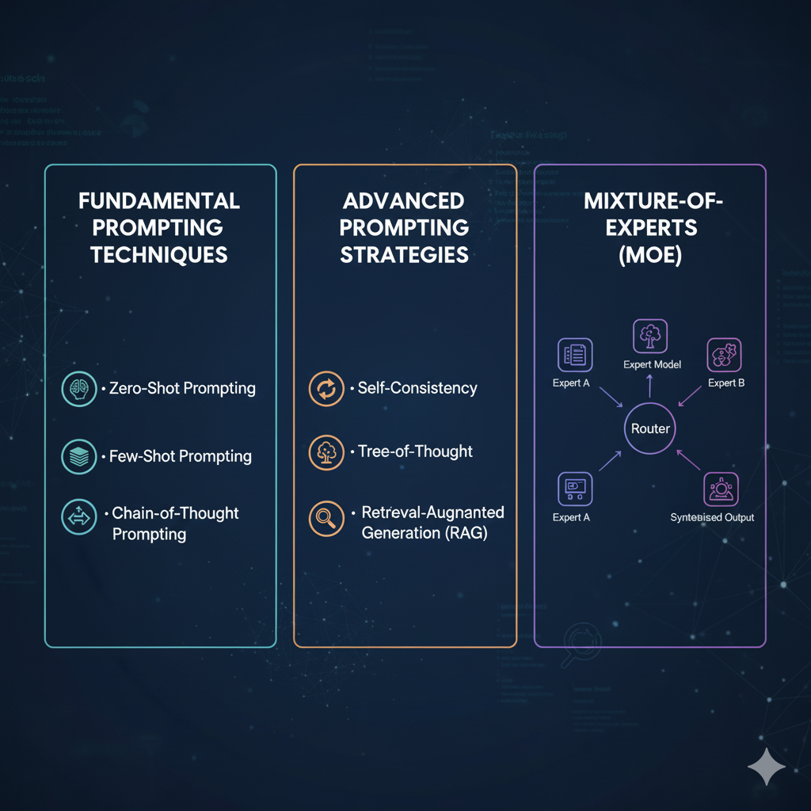
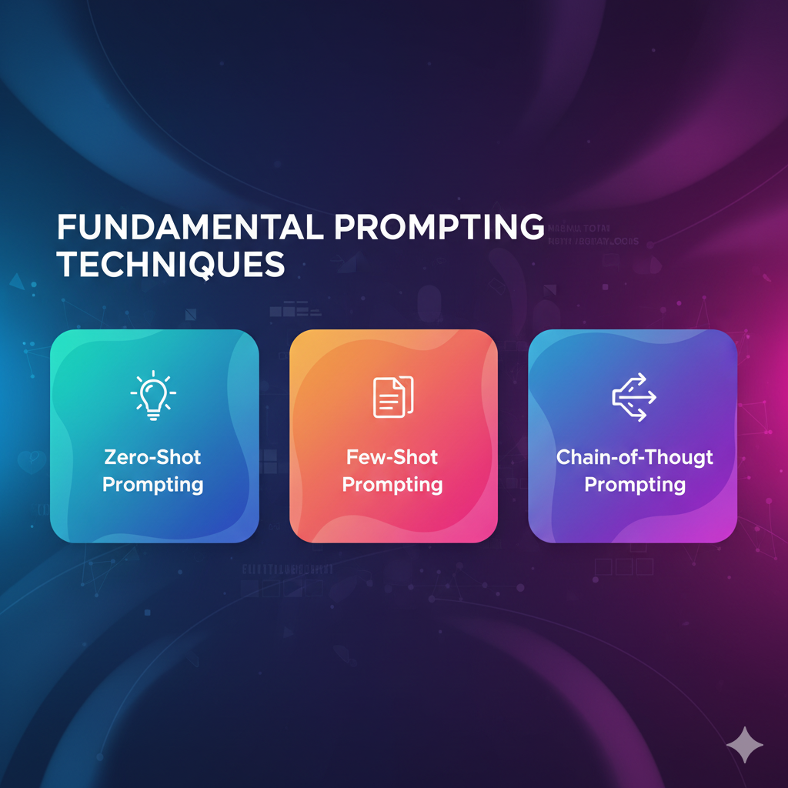
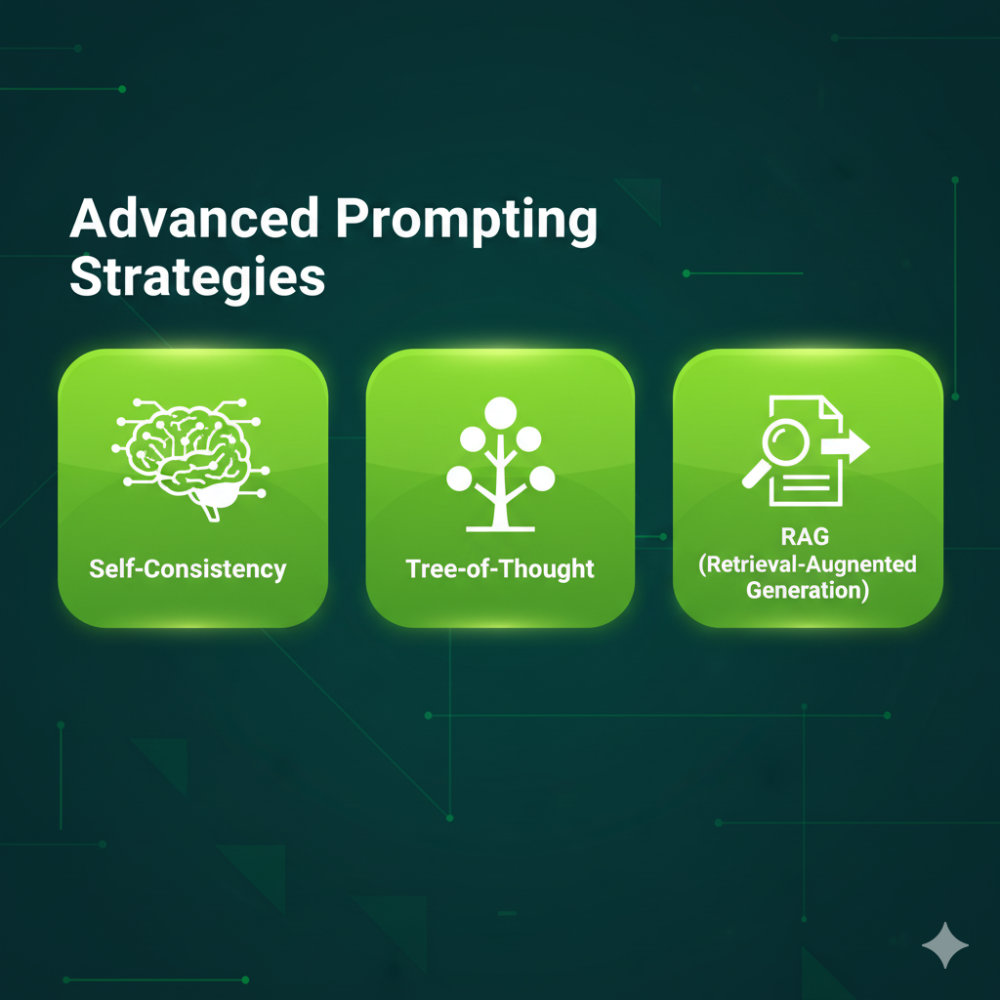
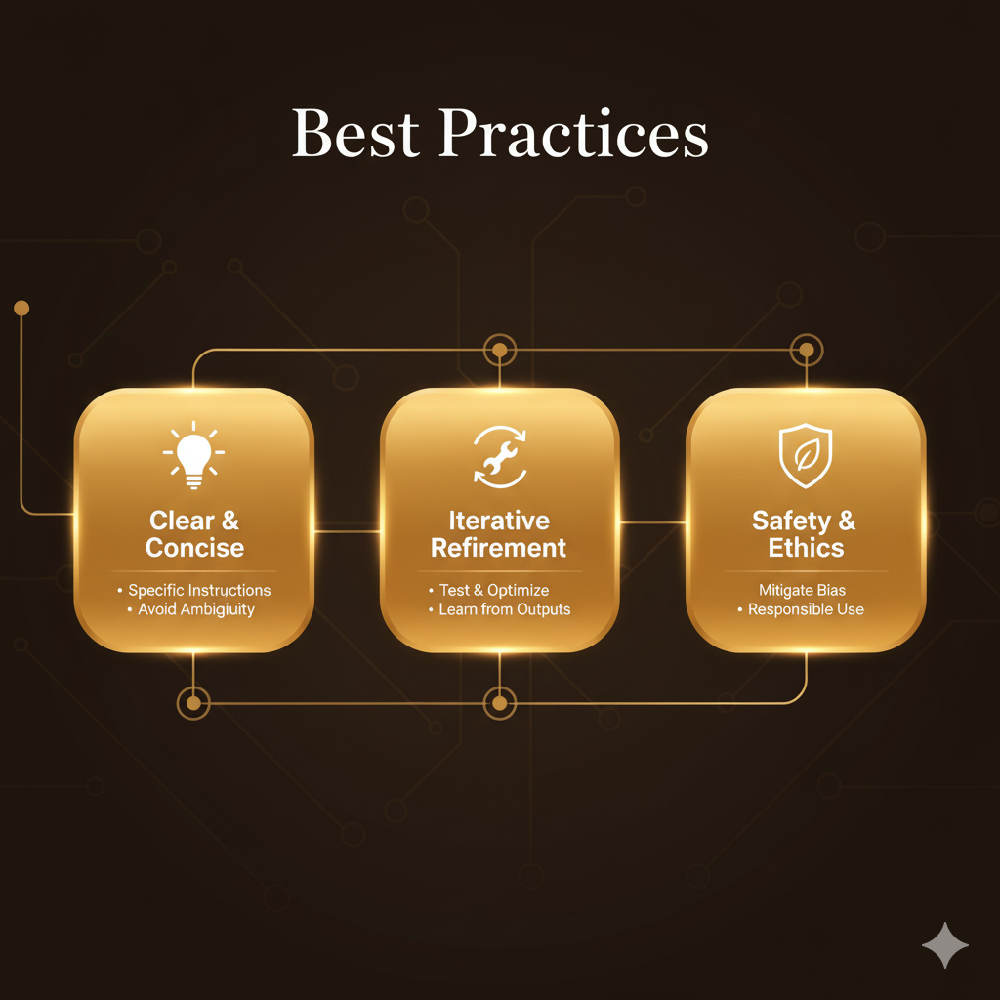
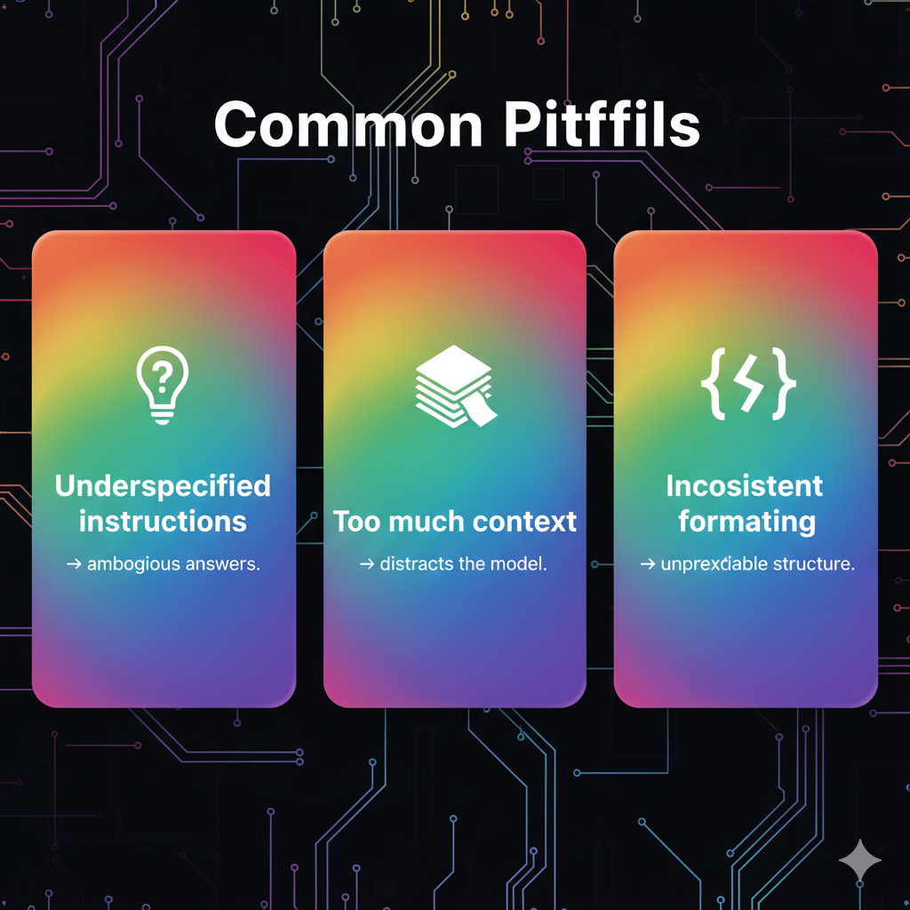

# Presentation-of-prompting-and-MOE

Presentation-Style Technical Guide
Fundamental Prompting Techniques • Advanced Prompting Strategies • Mixture-of-Experts (MoE)

1. Introduction
This guide provides a clear, developer-friendly overview of essential prompting methods, advanced strategies for controlling LLM behavior, and a high-level explanation of Mixture-of-Experts (MoE) architecture. Designed like a presentation, it uses concise sections, bullets, and visually oriented explanations.

2. Fundamental Prompting Techniques
   
 
 
2.1 Instruction Prompting
Give explicit commands (e.g., "Summarize this text in 2 sentences.")
Keep instructions short and unambiguous.

2.2 Context Provisioning
Add relevant background info.
Helps reduce hallucinations.

2.3 Input Formatting
Use numbered steps, tables, or bullet lists.
Models respond more reliably to structured input.

2.4 Few-Shot Prompting
Provide examples to guide output style.
Useful for formatting-specific tasks.
Visual Suggestion:
📄 Slide graphic showing “Instruction → Context → Examples → Output”.

3. Advanced Prompting Strategies
   

3.1 Chain-of-Thought (CoT)
Ask the model to “think step-by-step.”
Improves reasoning tasks.

3.2 Role-Based Prompting
Assign roles (e.g., “You are a cybersecurity auditor…”).
Controls tone & domain expertise.

3.3 Guardrail Prompting
Add constraints, boundaries, “do/don’t” rules.
Reduces unwanted outputs.

3.4 Self-Consistency Prompting
Generate multiple outputs → pick the best.
Helpful in reasoning-heavy tasks.
Visual Suggestion:
🧠 Flowchart showing branching solutions and selection of the most consistent result.

4. Mixture-of-Experts (MoE) Architecture
   

4.1 What is MoE?

A neural network design where multiple “experts” (specialized sub-models) exist, but only a few activate per query.

4.2 Key Components
Experts: Specialized networks for tasks (math, language, coding).
Router: Chooses which experts to activate.
Sparse Activation: Only 1–2% of parameters used per request.

4.3 Why MoE Matters
Enables large capacity without equally large compute cost.
Improves scalability, specialization, and performance.
Visual Suggestion:
📊 Diagram: input → router → selected experts → combined output.

5. Best Practices
   
 

Be explicit: unclear prompts lead to inconsistent output.
Add constraints when precision matters.
Use examples for formatting-heavy tasks.
Evaluate multiple outputs in critical workflows.

6. Common Pitfalls
   
   

Underspecified instructions → ambiguous answers.
Too much context → distracts the model.
Inconsistent formatting → unpredictable structure.

